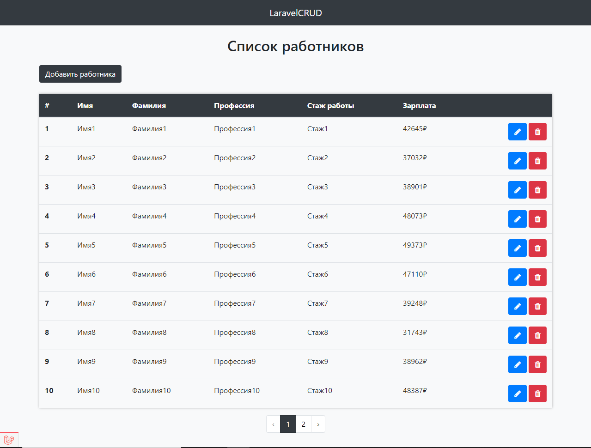
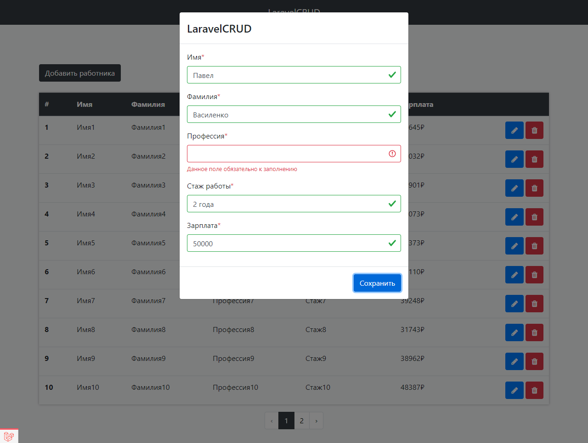

# Laravel CRUD + AJAX

Single page CRUD application.




## Install
cd project
`composer install` (see folder **vendor**)

cd project
`npm install` (see folder **node_modules**)

clone `.env.example` and rename to `.env`

Generate APP_KEY
`php artisan key:generate`

## Connection to DataBase `.env`
```
DB_CONNECTION=mysql
DB_HOST=localhost
DB_PORT=3306
DB_DATABASE=your db name
DB_USERNAME=your username
DB_PASSWORD=your password
```

## Running Migrations
`php artisan migrate`

## Running Seeders
`php artisan db:seed`
